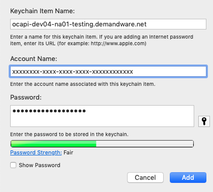

# dwre-tools

Various tools for use with Demandware instances. Written in python

## References

- [Export Cheat Sheet](EXPORT-CHEAT-SHEET.md)
- [Migrations Cheat Sheet](CHEAT-SHEET.md)

## Installation

### Homebrew (Easy Method)

Install the PixelMEDIA Homebrew Tap if not already installed

```
$ brew tap pixelmedia/pxl-homebrew git@bitbucket.org:pixelmedia/pxl-homebrew.git
# or for https:
$ brew tap pixelmedia/pxl-homebrew https://bitbucket.org/pixelmedia/pxl-homebrew.git
```

Install dwre-tools:

```
brew install dwre-tools
```

Later you can `brew update` and `brew upgrade dwre-tools` to get newer versions

### Windows Subsystem For Linux

The following is probably the best way to ensure installability on Linuxbrew (Homebrew > 1.9.0). Following installation instructions here: [https://github.com/Homebrew/brew/blob/master/docs/Linuxbrew.md](https://github.com/Homebrew/brew/blob/master/docs/Linuxbrew.md)

```
# install dependencies at the system level
$ sudo apt-get install build-essential curl file git libffi-dev libxml2-dev
$ brew tap pixelmedia/pxl-homebrew git@bitbucket.org:pixelmedia/pxl-homebrew.git
# or for https:
$ brew tap pixelmedia/pxl-homebrew https://bitbucket.org/pixelmedia/pxl-homebrew.git
$ brew install dwre-tools
```

#### Manual WSL Installation (old)

We want to first install python3.6 or 3.7. If you have that already you can ignore the first 3 commands below.

```
sudo add-apt-repository ppa:deadsnakes/ppa
sudo apt-get update
sudo apt-get install python3.6 python3.6-dev libssl-dev
curl https://bootstrap.pypa.io/get-pip.py | sudo python3.6
sudo -H python3.6 -mpip install pip==8.1.1
python3.6 -mpip install --upgrade https://devops-pixelmedia-com.s3.amazonaws.com/packages-374e8dc7/dwre-tools-latest.zip
```

To upgrade, rerun the last line above. Use `sudo` if that was used for the original install.
If upgrade fails, please `apt-get update` first. 


### Manual Method

Copy this command into your terminal (must have a suitable version of python: see [Windows Notes](#Windows_Notes) below):

```sh
pip3 install --upgrade https://devops-pixelmedia-com.s3.amazonaws.com/packages-374e8dc7/dwre-tools-latest.zip
```

### Development

```sh
python setup.py develop
```

### Windows Notes

Recommend using the Anaconda distribution of python as it comes pre-installed with many useful packages with native binaries: [http://continuum.io/downloads](http://continuum.io/downloads).

### OS X Notes

Highly recommend using the latest homebrew version of python **and** installing libxml2 from homebrew. Additionally you should run `brew doctor` and ensure any dependencies it complains about are satisfied (like having XCode with Command Line Tools installed)

```sh
brew install libxml2
brew install python3
```

## Config Setup
The tools requires at least one environment setup in your `.dwre.json` file.

- On windows: `C:\Users\[username]\.dwre.json`
- On Mac/Linux: `${HOME}/.dwre.json`

### Example File

```javascript
{
  "accountManager": {
    "username": "clavery@pixelmedia.com"
  }.
  "defaultProject" : "vbi",
  "projects" : {
    "vbi" : {
      "defaultEnvironment" : "dev02",
      "environments": {
        "dev02" : {
          "username" : "clavery",
          "password" : "OPTIONAL",
          "codeVersion" : "clavery",
          "server" : "dev02-us-vibram.demandware.net"
        }
      }
    }
  }
}
```

**Note: if you omit your account manager or environment password it will be prompted on the command line and the option to store it in your login keychain will be presented**

## Usage

Use the command line help to get updated commands/syntax:

All subcommands also have a help with `-h` or `--help`


```sh
$ dwre --help
```

Be default, all commands will execute against the default project specified in your .dwre.json file. If you'd like to use one of the alternative projects, you can use the `--project` flag.

```sh
$ dwre --project XXX
```


### `tail`

The tail command outputs and follows logfiles on your default or specified instance:

```
usage: dwre tail [-h] [-f FILTERS] [-i I]

optional arguments:
  -h, --help            show this help message and exit
  -f FILTERS, --filters FILTERS
                        logfile prefix filter [default 'warn,error,fatal']
  -i I                  refresh interval in seconds [default 5]
```

### `validate`

The validate command will validate an XML file or directory tree against the DWRE schemas included in the module.

```
usage: dwre validate [-h] target

positional arguments:
  target      filename or directory to validate

optional arguments:
  -h, --help  show this help message and exit
```

### `reindex`

The `reindex` subcommand will initiate a rebuild of all search indexes in the environment. This will rebuild across all sites configured.

```sh
dwre reindex
```

### `migrate`

The migrate command will perform "site imports" against the specified instance in the order specified in the `migrations.xml` file inside the migrations directory (default directory name: `migrations`).

#### Installation

This command requires that the cartridge `bm_dwremigrate` be installed and activated into the business manager site and that the BM user to be used is given the appropriate BM module permissions ("DWREMigrate"). **NOTE: As of version 1.5.0 the DWRE tools can perform this activation and access role step for you. The cartridge must simply be uploaded to the current code version (i.e. through eclipse or `dwre sync`**

- Copy the `bm_dwremigrate` directory into your project's cartridges directory. In Eclipse, import the cartridge into your project and link it to the Demandware server. Perform a full upload.
- In the Business Manager, go to *Administration -> Manage Sites*. Under the *Business Manager Site* section, click on the *Manage the Business Manager site* link. Add `bm_dwremigrate` to the end of the cartidge path.
- Go to *Administration -> Roles &amp; Permissions*. Select the user used to manage the site. Select the Business Manager Modules tab. Check the entry for `DWREMigrate` and click *Update*.

This command also requires that metadata be added to the instance however this will be done automatically, if required, at first run time. Metadata will also be automatically added as a migration in future versions.

An example `migrations.xml` follows (the XML will be validated against a schema in the module at run time):

```xml
<?xml version="1.0" encoding="UTF-8"?>
<migrations xmlns="http://www.pixelmedia.com/xml/dwremigrate">
	<migration id="2015-07-10_initial">
		<description>Initial Site Migration</description>
		<location>2015-07-10_initial</location>
	</migration>
	<migration id="2015-07-10_m2">
		<description>m2 description</description>
		<location>2015-07-10_m2</location>
		<parent>2015-07-10_initial</parent>
	</migration>
	<migration id="2015-07-10_m3">
		<location>2015-07-10_m3</location>
		<parent>2015-07-10_m2</parent>
	</migration>
</migrations>
```

The command has a number of subcommands

```
usage: dwre migrate [-h] [-n] [-d DIR]
                    {add,apply,validate,reset,run,set,runall} ...

optional arguments:
  -h, --help            show this help message and exit
  -n                    test run; do not execute migrations
  -d DIR, --dir DIR     migrations directory (default: migrations)

Sub Commands:
  {add,apply,validate,reset,run,set,runall}
    add                 add a new migration
    apply               apply migrations to environment
    validate            validate migrations directory
    reset               reset migration state to current code version
    run                 run a single site import without validating or
                        updating migrations
    set                 set the current migration version
    runall              run all migrations not currently applied without
                        validating or updating/applying migrations
```

#### Adding a Migration

```sh
usage: dwre migrate add [-h] [-d DESCRIPTION] [-r] [--hotfix] [--id ID]
                        directory

positional arguments:
  directory             migration directory (within migrations/)

optional arguments:
  -h, --help            show this help message and exit
  -d DESCRIPTION, --description DESCRIPTION
                        description of migration (default: empty)
  -r, --rename          rename folder to generated or specified ID
  --hotfix              create migration as a hotfix
  --id ID               id of migration (default: generated)
```

Use the `--hotfix` switch when adding a migration to add it as a hotfix. i.e. `dwre migrate add --hotfix -r -d 'some hotfix' hotfixdir`

### `export`

This commands opens a web browser with the ability to create an export file in the same manner
as business manager. It will then automatically download, extract and cleanup in business manager.

This command is intended to streamline the process of making migrations.

```
usage: dwre export [-h] directory

positional arguments:
  directory   destination directory

optional arguments:
  -h, --help  show this help message and exit
```

### `update`

This performs a self-update of the tools

### `sync`

The `sync` command syncs cartridges found in the current directory (and all subdirectories) to the specified server and code version (or default)

### `debug`

The `debug` command launches an interactive Script Debugging session with the specified instance and breakpoints given on the command line (filename:line_num). At least one breakpoint is required.

Some commands once launched (most are only relevant on a HALTED thread; i.e. a breakpoint has been hit)

- `continue,c` - continue execution to next breakpoint or running
- `next,n` - continue to next line, over any functions
- `into,i` - continue into function on current line
- `out,o` - jump out of function
- `print,p [objectpath] [re]` - prints the current stack frame members or a specific member/member path; if `re` is specified will further filter down the list to those matching (case insensitively) the regex pattern specified. (i.e. `p order total` to see members with names containing "total" in the order object)
- `stack,s` - print stack frame
- `list,l` - print current code surrounding breakpoint
- `eval,e` - eval an expression in the context of the HALTED thread.

Additionally any commands not defined will instead be "evaled" as if they were passed to the `eval` command (i.e. "1+2" will echo 3)

### `cred`

Get stored credentials from AWS (required IAM access)

Use `--help` on an individual command

```
usage: dwre cred [-h] {get,list,info,put} ...

optional arguments:
  -h, --help           show this help message and exit

Sub Commands:
  {get,list,info,put}
    get                get a credential
    list               list available keys
    info               credential information
    put                create or update credential
```

### `pw`

The `pw` command interfaces with the users `.dwre.json` file. 

```
usage: dwre pw [-h] {list,get} ...

optional arguments:
  -h, --help  show this help message and exit

Sub Commands:
  {list,get}
    list      list available accounts
    get       get account (project-env)
```

#### Shell Function

The following shell function requires OSX and the program `fzf` (`brew install fzf`). It uses the `dwre pw` commands to quickly list and find passwords, and copies the selected credential to the clipboard.

```
function dpw {
  dwre pw list |
    fzf |
    xargs dwre pw get |
    pbcopy
}
```

## Development / Contributing

To install in development mode first ensure the package is uninstalled

```sh
pip uninstall dwre_tools
```

Then run `pip install -e .[dev]` in the root directory to install the package in development mode. You can use a virtual environment to further contain the dependencies. (Note: the `[dev]` specification means install the extras used for development, like testing tools.

### Testing

Install testing requirements (already done if you installed in `[dev]` mode above) with: `pip install -e .[test]`

Tests are created via docstrings and the unittest modules in `dwre_tools/tests/`. We use the `pytest` library to simplify test discovery and flexibility.

The simplest way to run the tests is to run `python setup.py test` which will ensure the correct test libraries are installed. This will use `pytest` under the hood (as configured in `setup.py`)

`tox` is used to test multiple python versions at once. In particular we test against python 2.7 and python 3.6. See the `tox.ini` file for the setup. Run it with: `tox`. This will read the `tox.ini` and execute the test suite(s) in each environment.

**Note: it is a good idea to run the full test suite with `tox` before publishing code or new versions to ensure some manner of test coverage over both python2 and py3**

### Testing Tips

- Use the `responses` library and decorator to mock responses to the `requests` library (which is used for all http requests)
- Use the `unittest.mock` (or just `mock` in py2) to mock uncontrolled libraries like some filesystem and other standard library functions.
- Use the data in the `testdata` directory to simulate existing projects (i.e. migration directories and XML files). Use the `setUp` and `tearDown` methods to copy to a temporary directory for testing live filesystem affecting code.
- The quickest and most informative way to run tests is to use `pytest` directly and use verbose mode: `pytest --pyargs dwre_tools -v`.

## Todo

- Abstract sessions for all commands to better support session management (SSL, etc)
- Proper logging instead of print statements w/ "disable color if not a TTY"

## Notes

### Running Against Staging Server (Two Factor Auth)

You'll need a certificate and public key signed by CA key received from DWRE.

```sh
dwre --server cert.staging.web.stonewall.demandware.net \
--username clavery \
--password passwordhere \
--noverify \
--clientcert ~/code/swk/pki/cert.staging.web.stonewall.demandware.net_01.crt \
--clientkey ~/code/swk/pki/cert.staging.web.stonewall.demandware.net_01.key \
migrate -n apply
```

### Client Credentials (OCAPI/Account Manager) Only Usage

As of 1.17.0 the tool supports OCAPI only usage for a subset of commands
(`tail`, `watch`, `sync`, and `migrate`). This can be used for MFA required
accounts.

Update your config with a clientID and clientPassword key, removing
username/password and providng **at least** a `clientID` property:

```json
{
...
    "dev04": {
      "codeVersion": "foo",
      "server": "dev04-na01-test.demandware.net",
      "clientID": "xxxxxxxx-xxxx-xxxx-xxxx-xxxxxxxxxxxx",
      "clientPassword": "daskjlkjasdlkj"
    },
...
}
```

**Note: `clientPassword` can be omitted from the configuration file and stored in the systems
keychain/keystore under the server-specific key `ocapi-[SERVER]` or global `OCAPIClientCredentials` with clientID as the username.**

Username, password, useAccountManager can also be provided but client credentials will be preferred when a `clientID` exists and the subcommand supports it.



If `clientPassword` isn't provided or cannot be found in the keystore the tool
will prompt for it on the CLI.

The CLI arguments `--clientid`, `--clientpassword` are the equivalent to
these configuration attributes.

#### Business Manager Setup

Setup the following in OCAPI Client and WebDav Client permissions (in addition to any other permissions already configured)

WebDAV Client Permissions

```json
{  
   "clients":[  
      {  
         "client_id":"xxxxxxxx-xxxx-xxxx-xxxx-xxxxxxxxxxxx",
         "permissions":[  
            {  
               "path":"/impex/",
               "operations":[  
                  "read_write"
               ]
            },
            {  
               "path":"/cartridges/",
               "operations":[  
                  "read_write"
               ]
            },
            {  
               "path":"/logs/",
               "operations":[  
                  "read_write"
               ]
            }
         ]
      }
   ]
}
```

DATA API Permissions

**NOTE: Only the `code_versions`, `global_preferences`, and `jobs` resources below are necessary for primary functions.** 
The additional resources below them are for the `export` subcommand. If the client ID has no use
for the `export` command these can and should be omitted.

```json
{
  "_v":"20.8",
  "clients":
  [
    {
      "client_id":"xxxxxxxx-xxxx-xxxx-xxxx-xxxxxxxxxxxx",
      "resources":
      [
        {
          "resource_id":"/code_versions/**",
          "methods":["get", "patch", "delete"],
          "read_attributes":"(**)",
"write_attributes":"(**)"
        },
        {
          "resource_id":"/global_preferences/**",
          "methods":["get", "patch"],
          "read_attributes":"(**)",
"write_attributes":"(**)"
        },
        {
          "resource_id":"/jobs/**",
          "methods":["get", "post"],
          "read_attributes":"(**)",
"write_attributes":"(**)"
        },
        {
          "resource_id":"/sites",
          "methods":["get"],
          "read_attributes":"(**)"
        },
        {
          "resource_id":"/catalogs",
          "methods":["get"],
          "read_attributes":"(**)"
        }
      ]
    }
  ]
}
```

# License

This software is Copyright 2015-2019 PixelMEDIA, Inc and Charles Lavery (charles.lavery@gmail.com). All Rights Reserved.

Use of this software is only allowed under the express written permission of the copyright holders. Any other use, sale, distribution or duplication is strictly prohibited.
